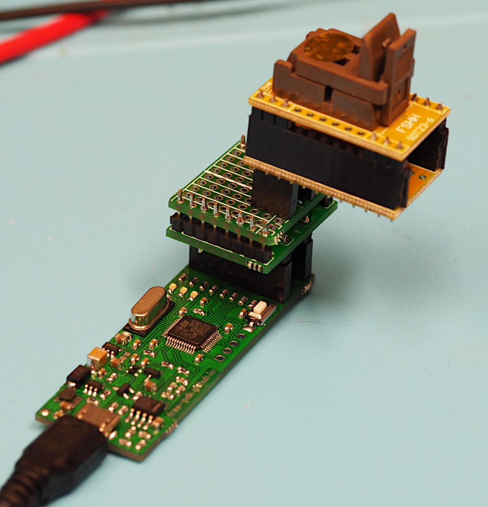
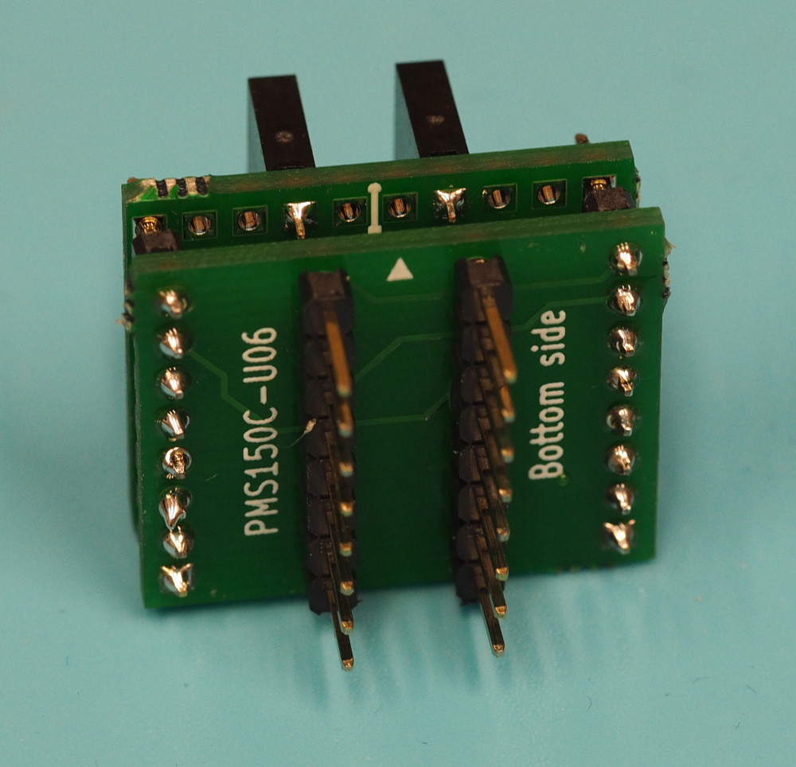
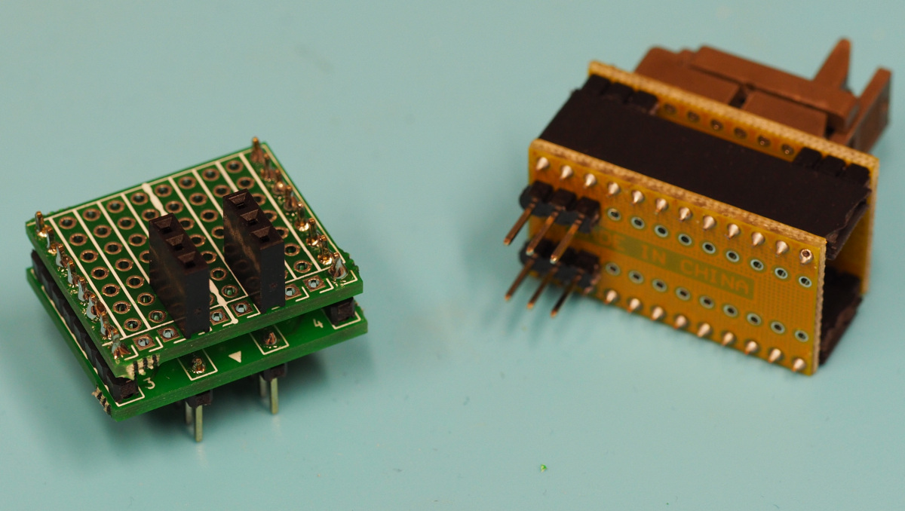
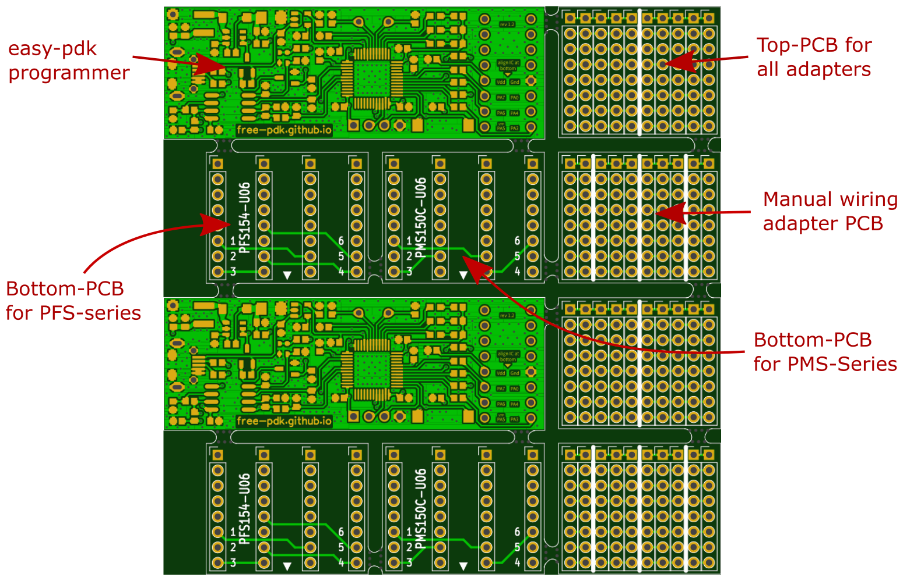

# Programming adapter PCBs

This directory contains several adapter pcbs for programming Padauk ICs that
don't have a pinout directly compatible with the easy-pdk-programmer hardware.

Since most programming sockets available on the market use a pin header spacing
of 0.3" like the programmer itself, one pcb isn't enough for an adapter. So all
adapters are built from 2 pcbs:

  - a bottom pcb, which does the actual routing of the programmer pins to the
    pins needed for the Padauk microcontroller
  - a top pcb, which routes the pins through strait and allows to provide
    socket headers in the necessary spacing for the actual programming socket

|  |  |

### PMS-Series SOT23-6

This adapter is primarily designed for the PMS150C-U06, but should also work for
other PMS-series ICs in SOT23-6, like the PMS154C-U06 or PMS132B-U06.

### PFS-Series SOT23-6

This adapter is primarily designed for the PFS154-U06, but should also work for
other PFS-series ICs in SOT23-6, like the PFS173-U06.

### SOT23-6 programming socket

The adapter pcbs described above are designed to have a SOT23-6 programming socket plugged into.

I tested this programming socket:
https://www.aliexpress.com/item//32811278237.html
 
### Manual wiring adapter

This is a adapter pcb without connected through tracks between the middle and outer rows.
The white lines in the silkscreen show the breaks. You can solder wires to the holes to
create an adapter for pinouts which don't have their own pcb adapter yet.

### Gerber set

The gerber directory contains a zipped set of Gerber files for a small panel with
all mentioned adapters and the programmer itself.

